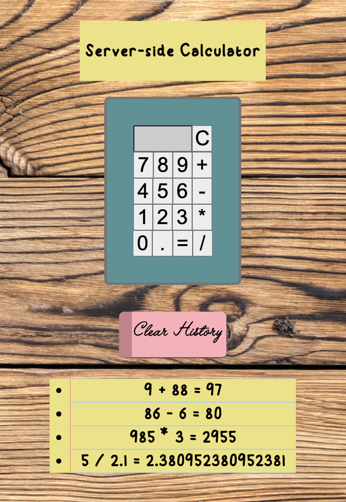

# Server-side Calculator

## Description

Welcome to my server-side calculator! 
In this project, I used jQuery ajax requests to send equations to the server to be calculated, and then have them appended to the page.

Though still a bit crude, I've put some work into making this actually look and function like an actual calculator.

## Screenshot

## Usage

Clicking each button will add that value to the input field. 

It's pretty simple, so it will only function properly if you give it 2 numbers and 1 operator. Your solution will show in the input field when you hit `=`. To input another equation, or to otherwise clear the input field, press the `C` button.

Your calculator history will appear on the "yellow paper" below. To clear it, simply click the "Clear History" eraser.

## Built with

Backend: 
- node.js
- npm
- express

Frontend:
- JavaScript
- jQuery
- HTML
- CSS

## TO DO:

Here's a detailed to do list that shows how I approached this project.

SETUP: 
- [x] server folder
    - [x] server.js
    - [x] modules folder
    - [x] public folder
        - [x] client.js
        - [x] jquery.js
        - [x] index.html
        - [x] style.css
- [x] npm init --yes
- [x] npm i express
- [x] package.json > "start:" "node server/server.js"

BASE MODE:
- [x] Create 2 input elements and a type of mathematical operation to select. 
    - [x] SERVER: POST to '/history' that takes equation objects
    - [x] TEST IN POSTMAN
    - [x] HTML: Setup inputs and buttons with IDs 
- [x] Create a submit button that will send the equation object to the server via POST.
    - [x] client.js: $.ajax POST referencing inputs
    - [x] SERVER: GET request to return the actual calculation.
    - [x] TEST IN POSTMAN
- [x] Create a C button that will clear user input fields.
    - [x] client.js: input.val('') attached to C button
- [x] Keep a historical record of all problems and solutions on the server to be displayed on the DOM.
    - [x] SERVER: '/history' will store all equation objects
    - [x] client.js $.ajax GET referencing '/history' to display on DOM

STRETCH GOALS:
- [x] Convert the interface to look and behave like an actual calculator
    - [] SERVER: possible need to take in only 1 key and output a solution from a single string.
    - [x] HTML: single input field, input buttons for 0-9 and decimal to add
    - [x] client.js: functionality to add clicked inputs to display in input. 
        - Equal button could do either of the following:
        - Change server side as listed above.
        - Possibly pass the string through some sort of function to separate the first number and second number into separate variables that can then pass into POST request data. 
- [x] Only allow POST to happen if all necessary input is ready.
- [x] Allow a user to clear history section with a button (DELETE request)
- [x] Allow a user to click on an entry in the history list to re-run that calculation.

BONUS ADD / CREATIVE IDEAS:
- [x] Use CSS to more accurately make it look like a calculator.

ETHOS / RULES:
- don't even THINK about touching the front end until you have your server-side all planned out.